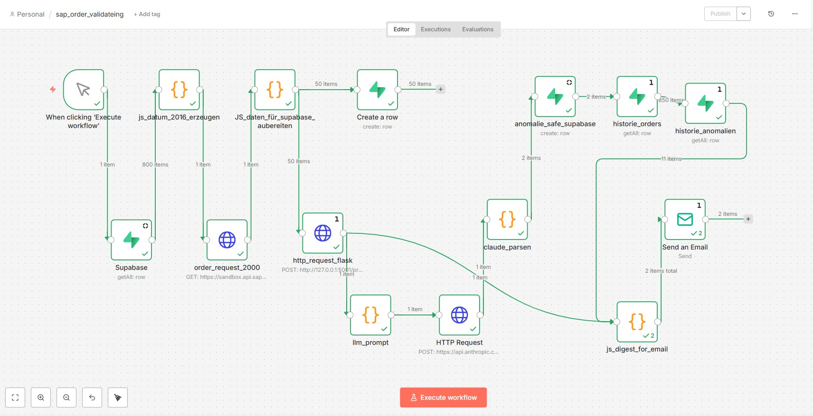
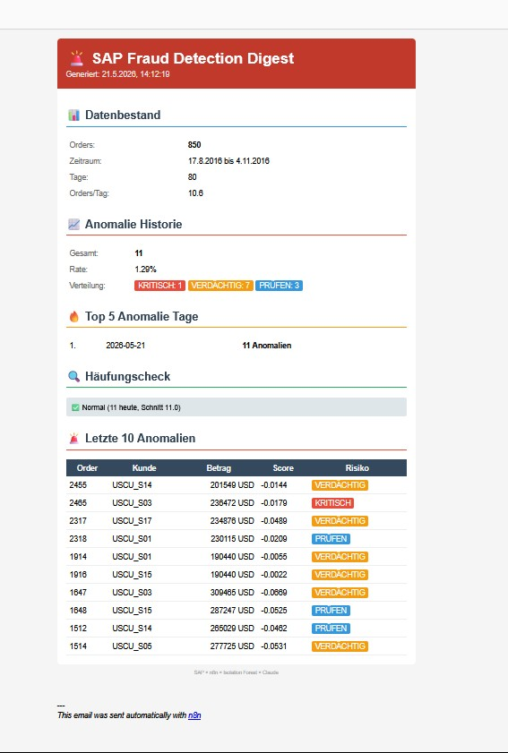
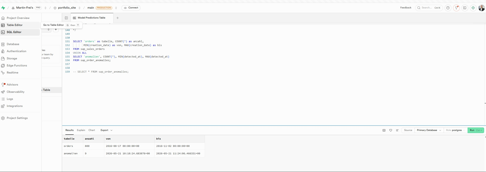

# 🚨 SAP Fraud Detection Pipeline

**Automated anomaly detection for SAP Sales Orders using Machine Learning and Explainable AI**


---

## 📋 Überblick

Diese Pipeline erkennt automatisch verdächtige Bestellungen in SAP Sales Order Daten. Sie kombiniert klassisches Machine Learning (Isolation Forest) mit Explainable AI (Claude) — jede erkannte Anomalie wird nicht nur markiert, sondern auf Deutsch erklärt und mit einer Handlungsempfehlung versehen.

**Das System beantwortet drei Fragen:**
- **Was** ist auffällig? → Isolation Forest erkennt statistische Ausreißer
- **Warum** ist es auffällig? → Claude AI erklärt die Anomalie
- **Was tun?** → Automatische Risikobewertung + Handlungsempfehlung

---

## 🏗️ Architektur

```
SAP S/4HANA (OData API)
        ↓ inkrementeller Datenabruf
n8n Workflow Engine
        ↓ Datentransformation
    ┌───┴───────────────┐
    ↓                   ↓
Supabase            Flask API
(PostgreSQL)        (Isolation Forest)
Orders speichern    Anomalien erkennen
                        ↓
                   Claude AI (Haiku)
                   Explainable AI
                        ↓
                   Supabase
                   Anomalien speichern
                        ↓
                   Email Digest
                   Historie + Häufungscheck
```

---

## 🔍 Drei-Layer Anomalieerkennung

| Layer | Technologie | Funktion |
|-------|------------|----------|
| **Layer 1** | Isolation Forest | Statistische Ausreißer in Bestelldaten erkennen |
| **Layer 2** | Claude AI | Jede Anomalie auf Deutsch erklären + Handlungsempfehlung |
| **Layer 3** | Häufungsanalyse | Muster über Zeit erkennen (Peaks, Trends, Wochentage) |

---

## 📊 Ergebnisse

Trainiert auf **2.000 SAP Sales Orders**, getestet mit **12.000+ Orders**:

```
✅ 800 Orders verarbeitet
✅ 9 Anomalien automatisch erkannt (1.13% Rate)
✅ Verteilung: 0 KRITISCH | 6 VERDÄCHTIG | 3 PRÜFEN
✅ Jede Anomalie mit Claude AI Statement
✅ Automatischer HTML Email Digest
```

**Beispiel Claude Analyse:**
> *Order 1647 | USCU_S03 | 309.465 USD*
> "Der Betrag von 309.465 USD weicht signifikant vom normalen Bestellmuster ab.
> Empfehlung: Sofortige Verifizierung durch Compliance-Team."
> **Risiko: VERDÄCHTIG**

---

## 🛠️ Tech Stack

| Komponente | Technologie | Zweck |
|-----------|------------|-------|
| Datenquelle | SAP S/4HANA Cloud (OData V2) | Sales Order Daten |
| Orchestrierung | n8n (Self-Hosted) | Workflow Automation |
| ML Modell | Isolation Forest (scikit-learn) | Anomalieerkennung |
| AI Erklärung | Claude Haiku (Anthropic API) | Explainable AI |
| Prediction API | Flask (Python) | ML Model Serving |
| Datenbank | Supabase (PostgreSQL) | Orders + Anomalien |
| Benachrichtigung | GMX SMTP | HTML Email Digest |

---

## 📂 Projektstruktur

```
sap_n8n_demo/
├── A_dokumetiation/
│   ├── 2026-05-15_sap_n8n_claude_fraud.md
│   ├── 2026-05-20_sap_n8n_order_detection.md
│   ├── 2026-05-21_sap_n8n_order_detection.md
│   └── Startcode_batDatei.md
├── data/
│   └── sap_order_raw.csv
├── models/
│   ├── sap_isolation_forest.pkl
│   ├── label_encoder_customer.pkl
│   └── label_encoder_user.pkl
├── python/
│   ├── requirements.txt
│   ├── predict/
│   │   └── predict_server.py
│   ├── training/
│   │   └── isolation_forest_train.py
│   └── utils/
│       └── sales_order_eda.py
├── workflows/
│   ├── sap_claude_analyse_v1.json
│   └── sap_order_validating.json
├── .env                 ← API Keys (nicht in Git)
├── .gitignore
├── README.md
└── start_n8n.bat        ← n8n mit Node v22 starten
```

---

## 🚀 Setup & Installation

### Voraussetzungen
- Node.js v22 (für n8n)
- Python 3.x
- SAP API Business Hub Account
- Anthropic API Key
- Supabase Projekt

### 1. Repository klonen
```bash
git clone https://github.com/Martin-Frei/sap_n8n_demo.git
cd sap_n8n_demo
```

### 2. Python Environment
```bash
python -m venv venv_sap
venv_sap\Scripts\activate
pip install -r python/requirements.txt
```

### 3. Environment Variables
```bash
# .env Datei erstellen
SAP_API_KEY=dein_sap_key
ANTHROPIC_API_KEY=dein_anthropic_key
SUPABASE_URL=https://xxx.supabase.co
SUPABASE_KEY=dein_supabase_key
```

### 4. n8n starten
```bash
start_n8n.bat
# oder
& "pfad\zu\node22\node.exe" "pfad\zu\n8n\bin\n8n"
```

### 5. Flask Prediction Server starten
```bash
python python/predict/predict_server.py
# → läuft auf http://localhost:5001
```

### 6. Workflow importieren
```
n8n → Import from File → workflows/sap_order_validating.json
```

---

## 📧 Email Digest Beispiel

Der automatische Digest enthält:

| Sektion | Inhalt |
|---------|--------|
| 📊 Datenbestand | Gesamtzahl Orders, Zeitraum, Orders/Tag |
| 📈 Anomalie Historie | Gesamtzahl, Rate, Verteilung (KRITISCH/VERDÄCHTIG/PRÜFEN) |
| 🔥 Top 5 Anomalie Tage | Tage mit den meisten Anomalien |
| 🔍 Häufungscheck | Vergleich heute vs. Durchschnitt |
| 🚨 Letzte 10 Anomalien | Detail mit Order, Kunde, Betrag, Score, Risiko |

---

## 🔄 Workflow Design (2-Wege-Strategie)

### Workflow A — Täglicher Live-Check
```
1. Supabase → letztes bekanntes Datum
2. SAP OData → nur neue Orders seit letztem Datum
3. Supabase → neue Orders speichern
4. Flask → Isolation Forest predict()
5. Claude → Anomalien erklären (1 API Call für alle)
6. Supabase → Anomalien + Statement speichern
7. Email → HTML Digest versenden
```

### Workflow B — Wöchentliches Retraining
```
1. Supabase → alle historischen Orders laden
2. Isolation Forest → model.fit() neu trainieren
3. joblib.dump() → Modell überschreiben
```

---

## 🧠 Isolation Forest — Wie es funktioniert

Das Modell wurde mit 2.000 SAP Orders trainiert und erkennt Anomalien anhand von:

| Feature | Beschreibung |
|---------|-------------|
| `net_amount` | Bestellbetrag — extreme Werte werden erkannt |
| `customer_encoded` | Kundenverhalten — unbekannte oder untypische Kunden |
| `user_encoded` | Ersteller — ungewöhnliche User-Aktivitäten |

**Konfiguration:**
```python
IsolationForest(
    contamination=0.05,    # 5% erwartete Anomalierate
    n_estimators=100,      # 100 Entscheidungsbäume
    random_state=42
)
```

**Validierung per PowerShell:**
```
FAKE_CUSTOMER + 500k USD  → KRITISCH  (Score: -0.179)
Bekannter Kunde + 0.01    → VERDÄCHTIG (Score: -0.085)
Bekannter Kunde + 425k    → KRITISCH  (Score: -0.110)
Normaler Betrag           → VERDÄCHTIG (Score: -0.051)
```

## 📸 Screenshots

### n8n Workflow


### Email Digest


### Anomalien in Supabase


---

## ⚠️ Bekannte Limitierungen

**SAP Sandbox Datenkonsistenz:**
Sales Order API und Business Partner API verwenden unterschiedliche Test-IDs — ein direkter JOIN ist in der Sandbox nicht möglich. In einem produktiven SAP System sind alle IDs konsistent verknüpft.

**SAP Sandbox Daten:**
Die Sandbox enthält statische Testdaten (Aug–Nov 2016). In Produktion würde der Workflow täglich neue Orders verarbeiten.

---

## 📚 Dokumentation

Detaillierte Schritt-für-Schritt Dokumentation in `A_dokumentation/`:

- **Tag 1:** SAP API Setup, n8n Installation, erster Claude Workflow
- **Tag 2:** Sales Order Pipeline, EDA, Isolation Forest Training
- **Tag 3:** Flask Server, End-to-End Pipeline, Email Digest

---


---

## 🇬🇧 English Summary

**For my friends and tutors**

This project demonstrates an automated Fraud Detection Pipeline for SAP Sales Orders:

- **Data Source:** SAP S/4HANA Cloud via OData API
- **ML Model:** Isolation Forest (scikit-learn) for anomaly detection
- **Explainable AI:** Claude Haiku explains every anomaly in plain language
- **Orchestration:** n8n workflow engine
- **Storage:** Supabase (PostgreSQL)
- **Reporting:** Automated HTML email digest with history and trend analysis

**Three-Layer Detection:**
1. **Isolation Forest** — finds statistical outliers in order data
2. **Claude AI** — explains why each order is suspicious
3. **Frequency Analysis** — detects unusual patterns over time

The first workflow (Email Fraud Detection) was built in one evening. The full Sales Order Anomaly Detection pipeline took two mornings to complete.
---

## 👤 Autor

**Martin Freimuth**
- 🌐 [Portfolio](https://www.martin-freimuth.dev)
- 💼 [LinkedIn](https://www.linkedin.com/in/martin-freimuth/)
- 📧 mat.frei@gmx.de

---

## 📝 Lizenz

Dieses Projekt dient zu Demonstrations- und Lernzwecken.