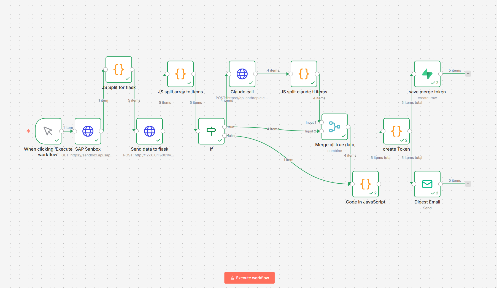
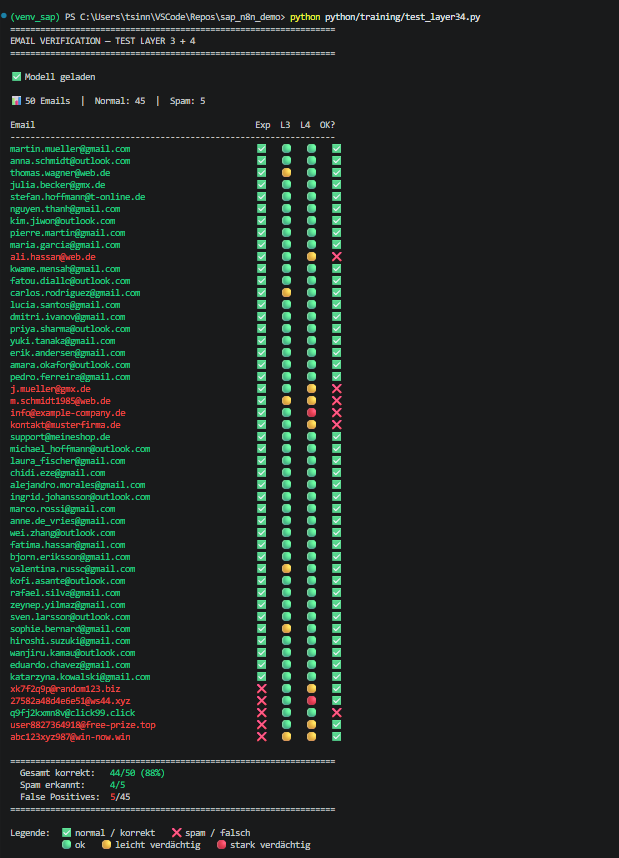
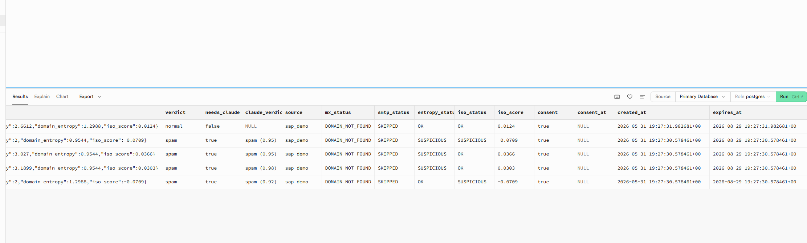

# 🚨 SAP Fraud Detection Pipeline
<div align="right">


</div>

**Automated anomaly detection for SAP Sales Orders and Email Verification using Machine Learning and Explainable AI**


---

## 📋 Überblick

Dieses Projekt demonstriert zwei vollständige Fraud Detection Pipelines:

**Pipeline 1 — SAP Sales Order Anomalie Detection**
Erkennt automatisch verdächtige Bestellungen in SAP Sales Order Daten. Kombiniert Isolation Forest mit Claude AI — jede Anomalie wird erklärt und mit Handlungsempfehlung versehen.

**Pipeline 2 — Email Verification (5-Layer)**
Prüft Email-Adressen aus SAP Business Partner Daten auf Validität und Spam-Muster. Kombiniert DNS, SMTP, Mathematik, ML und AI zu einer Defense-in-Depth Architektur.

---

## 🏗️ Gesamt-Architektur

```
SAP S/4HANA (OData API)
        ↓
n8n Workflow Engine
        ↓
    ┌───┴──────────────────────┐
    ↓                          ↓
Pipeline 1                 Pipeline 2
Sales Order                Email Verification
Anomalie Detection         5-Layer System
    ↓                          ↓
Flask API (Port 5001)      Flask API (Port 5001)
/predict                   /verify
    ↓                          ↓
Isolation Forest           Layer 1: MX Check
+ Claude AI                Layer 2: SMTP Check
    ↓                      Layer 3: Entropy Check
Supabase                   Layer 4: Isolation Forest
sap_order_anomalies        Layer 5: Claude AI
                               ↓
                           Supabase
                           email_checks
```

---

## 🔍 Pipeline 1 — Sales Order Anomalie Detection

### Drei-Layer Erkennung

| Layer | Technologie | Funktion |
|-------|------------|----------|
| **Layer 1** | Isolation Forest | Statistische Ausreißer in Bestelldaten |
| **Layer 2** | Claude AI | Anomalie erklären + Handlungsempfehlung |
| **Layer 3** | Häufungsanalyse | Muster über Zeit (Peaks, Trends) |

### Features für Isolation Forest
| Feature | Beschreibung |
|---------|-------------|
| `net_amount` | Bestellbetrag — extreme Werte |
| `customer_encoded` | Kundenverhalten — unbekannte Kunden |
| `user_encoded` | Ersteller — ungewöhnliche User |

### Ergebnisse
```
✅ 900 Orders verarbeitet
✅ 12 Anomalien erkannt (1.3% Rate)
✅ Jede Anomalie mit Claude AI Statement
✅ Automatischer HTML Email Digest
```

---

## 📧 Pipeline 2 — Email Verification (5-Layer)

### Defense in Depth Architektur

| Layer | Technologie | Funktion | Training nötig? |
|-------|------------|----------|----------------|
| **Layer 1** | DNS MX Check | Domain hat Mailserver? | Nein |
| **Layer 2** | SMTP Handshake | Mailbox existiert? | Nein |
| **Layer 3** | Entropy Check | Struktur verdächtig? (Mathematik) | Nein |
| **Layer 4** | Isolation Forest | ML Anomalie Detection | Ja |
| **Layer 5** | Claude AI | Kontext + Erklärung | Nein |
| **Layer 6** | Human in the Loop | Admin Entscheidung (geplant) | Nein |

### Layer 5 Regel
```
🟡 SLIGHT oder 🔴 SUSPICIOUS bei Layer 3 oder 4 → Claude prüft
🟢 OK bei beiden → nur Layer 1+2 als Absicherung
```

### Entropy Check (Layer 3)
```
< 1.0          → 🔴 SUSPICIOUS  (zu simpel: aaaaaaa@...)
1.0 - 3.5      → 🟢 OK          (normal: martin.mueller@...)
3.5 - 3.8      → 🟡 SLIGHT      (leicht erhöht)
> 3.8          → 🔴 SUSPICIOUS  (zu chaotisch: xk7f2q9p@...)
```

### Email Isolation Forest Features
```python
feature_cols = [
    'local_entropy', 'domain_entropy', 'digit_ratio',
    'special_chars', 'local_length', 'domain_length',
    'is_trusted_domain', 'is_suspicious_tld',
    'has_dot', 'has_underscore',
    'shortest_part', 'longest_part'
]
```

### Testergebnis (50 Emails)
```
Gesamt korrekt:   44/50 (88%)
Spam erkannt:     4/5
False Positives:  5/45 → gehen zu Claude (Layer 5)
```

### DSGVO Konzept
```
Email wird NIE gespeichert!
→ simpleHash für Wiedererkennung (Whitelist)
→ Features anonymisiert in Supabase
→ Löschung nach 90 Tagen (expires_at)
```

---

## 🛠️ Tech Stack

| Komponente | Technologie | Zweck |
|-----------|------------|-------|
| Datenquelle | SAP S/4HANA Cloud (OData V2) | Orders + Business Partner |
| Orchestrierung | n8n (Self-Hosted) | Workflow Automation |
| ML Modell 1 | Isolation Forest (scikit-learn) | SAP Order Anomalieerkennung |
| ML Modell 2 | Isolation Forest (scikit-learn) | Email Anomalieerkennung |
| AI Erklärung | Claude Haiku (Anthropic API) | Explainable AI |
| Prediction API | Flask (Python) | ML Model Serving |
| Datenbank | Supabase (PostgreSQL) | Orders + Anomalien + Email Checks |
| Benachrichtigung | GMX SMTP | HTML Email Digest |

---

## 📂 Projektstruktur

```
sap_n8n_demo/
├── A_dokumentation/
│   ├── 2026-05-15_sap_n8n_claude_fraud.md
│   ├── 2026-05-20_sap_n8n_order_detection.md
│   ├── 2026-05-21_sap_n8n_order_detection.md
│   ├── 2026-05-29_email_Verification_Planung.md
│   ├── 2026-05-31_aufbau_optimierung_erkenntniss_layer_3_4.md
│   └── 2026-05-31_email_verification_workflow_komplett.md
├── data/
│   └── test_emails.json          ← 50 Test Emails
├── models/
│   ├── sap_isolation_forest.pkl
│   ├── label_encoder_customer.pkl
│   ├── label_encoder_user.pkl
│   ├── email_isolation_forest.pkl ← NEU
│   └── email_feature_cols.pkl     ← NEU
├── python/
│   ├── generate/
│   │   ├── generator.py          ← Email Generator (18 Kulturkreise)
│   │   ├── config.yaml           ← Konfiguration
│   │   └── examples/
│   │       └── sample_1000.csv   ← Trainingsdaten
│   ├── predict/
│   │   └── predict_server.py     ← Flask Server (Layer 1-4 + Layer 6)
│   ├── training/
│   │   ├── isolation_forest_train.py
│   │   ├── email_forest_train.py  ← NEU
│   │   └── test_layer34.py        ← NEU visueller Test
│   ├── utils/
│   │   └── sales_order_eda.py
│   └── requirements.txt
├── workflows/
│   ├── sap_claude_analyse_v1.json
│   ├── sap_order_validating.json
│   └── email_verification_v1.json ← NEU
├── .env                 ← API Keys (nicht in Git)
├── .gitignore
├── README.md
└── start_n8n.bat
```

---

## 🚀 Setup & Installation

### Voraussetzungen
- Node.js v22 (für n8n)
- Python 3.x
- SAP API Business Hub Account
- Anthropic API Key
- Supabase Projekt

### 1. Repository klonen
```bash
git clone https://github.com/Martin-Frei/sap_n8n_demo.git
cd sap_n8n_demo
```

### 2. Python Environment
```bash
python -m venv venv_sap
venv_sap\Scripts\activate
pip install -r python/requirements.txt
```

### 3. Environment Variables
```bash
# .env Datei erstellen
SAP_API_KEY=dein_sap_key
ANTHROPIC_API_KEY=dein_anthropic_key
SUPABASE_URL=https://xxx.supabase.co
SUPABASE_KEY=dein_supabase_key
```

### 4. Modelle trainieren
```bash
# SAP Order Modell
python python/training/isolation_forest_train.py

# Email Generator
cd python/generate
python generator.py
cd ../..

# Email Modell
python python/training/email_forest_train.py
```

### 5. Flask Server starten
```bash
python python/predict/predict_server.py
# → läuft auf http://localhost:5001
# ✅ SAP Modell geladen
# ✅ Email Modell geladen
```

### 6. n8n starten
```bash
start_n8n.bat
```

### 7. Workflows importieren
```
n8n → Import from File → workflows/sap_order_validating.json
n8n → Import from File → workflows/email_verification_v1.json
```

---

## 📸 Screenshots

### Pipeline 1 — SAP Order Workflow


### Email Digest


### SAP Anomalien in Supabase


### Pipeline 2 — Email Verification Workflow


### Layer 3+4 Test Output


### Email Checks in Supabase


---

## 🌍 Email Generator — Open Source

Der synthetische Email-Adress-Generator ist als eigenes Tool verfügbar:

```
python/generate/
├── generator.py   ← konfigurierbar via config.yaml
└── config.yaml    ← 18 Kulturkreise, Spam Patterns, Domains
```

**Features:**
- 180 Vornamen + 180 Nachnamen aus 18 Kulturkreisen
- RFC 2606 konforme Domains (nie erreichbar, nie echt!)
- 5 verschiedene Spam-Patterns
- Kein kultureller Bias — Struktur statt Namen bewerten

---

## ⚠️ Bekannte Limitierungen

**SAP Sandbox:**
Die Sandbox enthält statische Testdaten. In Produktion würde der Workflow täglich neue Orders und Business Partner verarbeiten.

**Email Modell:**
Trainiert auf synthetischen Daten → 88% Erkennungsrate. Mit echten Produktionsdaten (Honeypot, HIL Feedback) steigt die Genauigkeit.

---

## 📚 Dokumentation

Detaillierte Schritt-für-Schritt Dokumentation in `A_dokumentation/`:

| Datum | Thema |
|-------|-------|
| 2026-05-15 | SAP API Setup, n8n, erster Claude Workflow |
| 2026-05-20 | Sales Order Pipeline, EDA, Isolation Forest |
| 2026-05-21 | Flask Server, End-to-End, Email Digest |
| 2026-05-29 | Email Verification Planung, 5-Layer Konzept |
| 2026-05-31 | Layer 3+4 Aufbau, Generator, n8n Workflow |

---

## 🇬🇧 English Summary

**For my friends and tutors**

This project demonstrates two automated Fraud Detection Pipelines built with SAP, n8n, Python, and Claude AI:

**Pipeline 1 — SAP Sales Order Anomaly Detection:**
- Isolation Forest detects statistical outliers in order data
- Claude AI explains every anomaly in plain language
- Automated HTML email digest with history and trend analysis

**Pipeline 2 — Email Verification (5-Layer Defense in Depth):**
- Layer 1: DNS MX Check
- Layer 2: SMTP Handshake
- Layer 3: Entropy Check (mathematics, no training needed)
- Layer 4: Isolation Forest (trained on 1000 synthetic emails, 18 cultural backgrounds)
- Layer 5: Claude AI (context + explanation for borderline cases)

**Key insight:** No single layer is perfect. Together they achieve 88% accuracy — exactly like real AML detection systems.

---

## 👤 Autor

**Martin Freimuth**
- 🌐 [Portfolio](https://www.martin-freimuth.dev)
- 💼 [LinkedIn](https://www.linkedin.com/in/martin-freimuth/)
- 📧 martin@houseofstocks.dev

---

## 📝 Lizenz

Dieses Projekt dient zu Demonstrations- und Lernzwecken.
